# AWS Lambda Lab
### A hands on introduction to how lambdas, gateways and databases work in AWS

In this lab, we will 
- Set up a database
- Create two lambdas that create and retrieve data from a database
- Hook the lambdas up to REST methods
- Actually have everything working

While doing this, we will learn
- What RDS is and how to instantiate a database
- What a lambda function is and how to create one
- How to have your lambda talk to your database
- How to map REST requests to your lambdas

Everyone new to AWS spends a long time looking around in configuration files to get stuff to work. By doing a fairly useful thing like connecting REST to a database in a step-by-step way, I hope to have you avoid some of that first time frustration.


## Home prep for you

I need three things of you before we start the lab
1. You all have to be able to log in to AWS Console. If you don't have an account, head to https://aws.amazon.com/ and hit **Sign up**. It takes a couple of minutes and requires personal details like credit card, but everything in this lab is free.
2. Clone this repo to your personal computer.
3. We will be zipping files, make sure you have some program that can create a .zip


## Home prep for me

I have prepared the lambda functions. The lambdas are written in Python and are located in the *lambdas*-folder in this repo. The files I wrote are called `index.py`, the rest is libs. We won't talk about the lambda code very much in this lab, but you can totally check them out. They basically just validate the input and call the database.


# Creating the database

## Sign in to AWS

Sign in to AWS at https://console.aws.amazon.com/. The sign in option is in the top right corner. We are going to the *Service* called *RDS*.


## Go to RDS

RDS stands for Relational Database Service. 

Click **Services** in the top menu bar, then click **RDS** in the menu. 

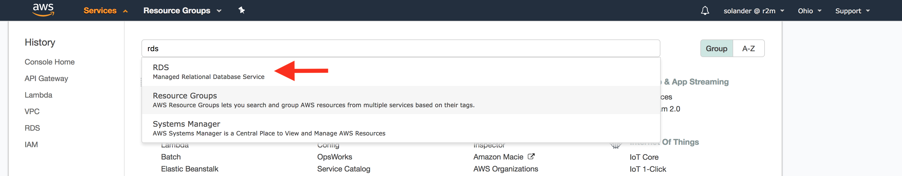


## Create Database

In the RDS page, click the big orange button called **Create function**.

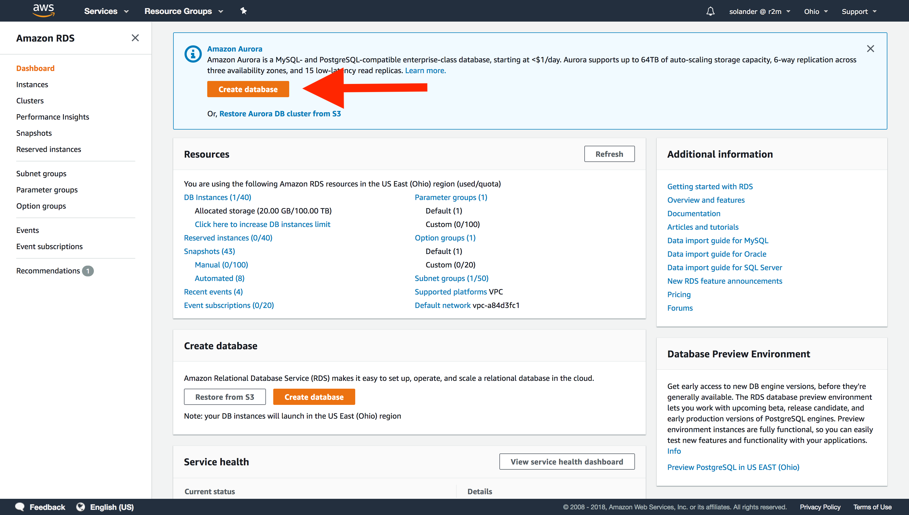


## Select database enging

Choose `MySQL` as database engine. For this lab, we're only using the free tier available stuff, so check the checkbox called `Only enable options elligible for frie RDS Free Usage Tier`. Click **Next**.

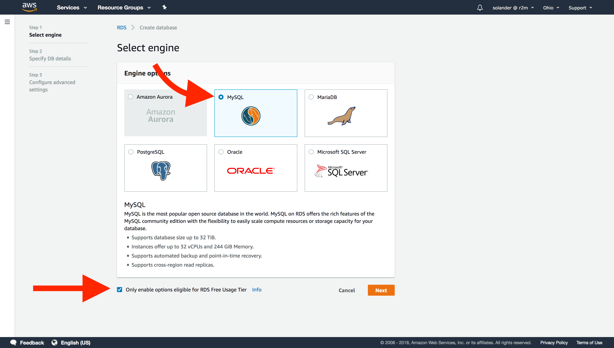


## Specify DB details

Leave the top of the page as is, and scroll down to the bottom of the page.

Go to the section **Function code**

Field | Value
--- | ---
**DB instance identifier** | `aws-lambda-lab`
**Master username** | `root`
**Password** | `your-super-safe-password` (Whatever you like, but remember it)

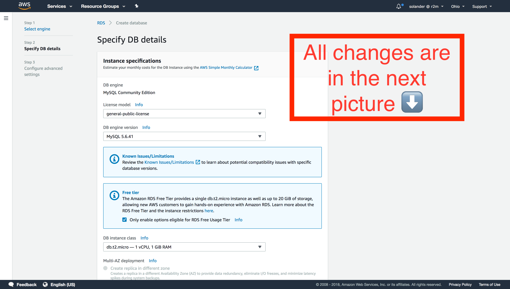

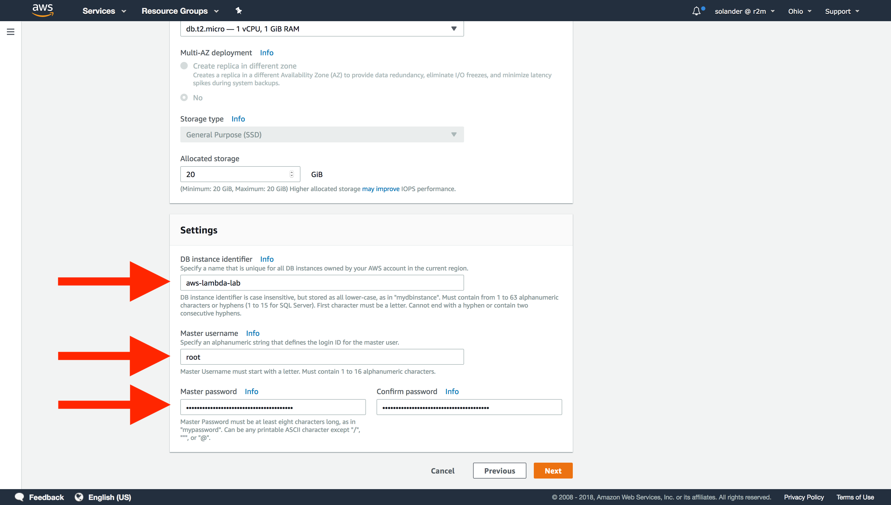


## Configure advanced settings: Public accessibility

We're going to have the database be publically accessible to make this lab a little easier to setup.

Field | Value
--- | ---
**Public accessibility** | `Yes`

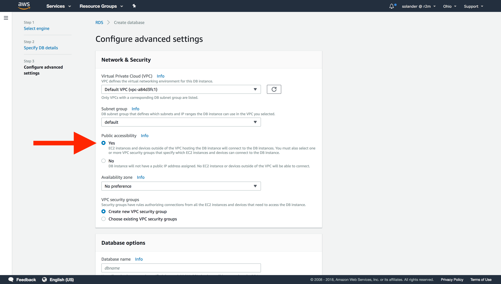


## Configure advanced settings: Database name

Specify the database name

Field | Value
--- | ---
**Database name** | `messages`

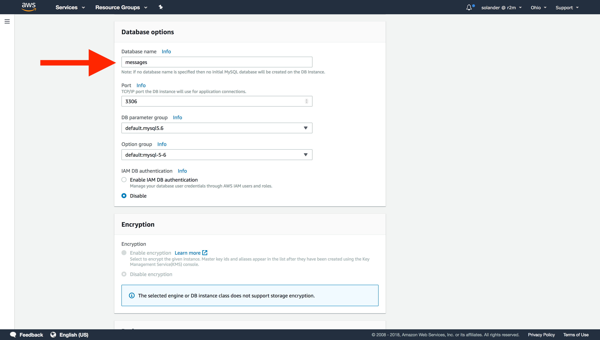

Scroll down and click **Create database**

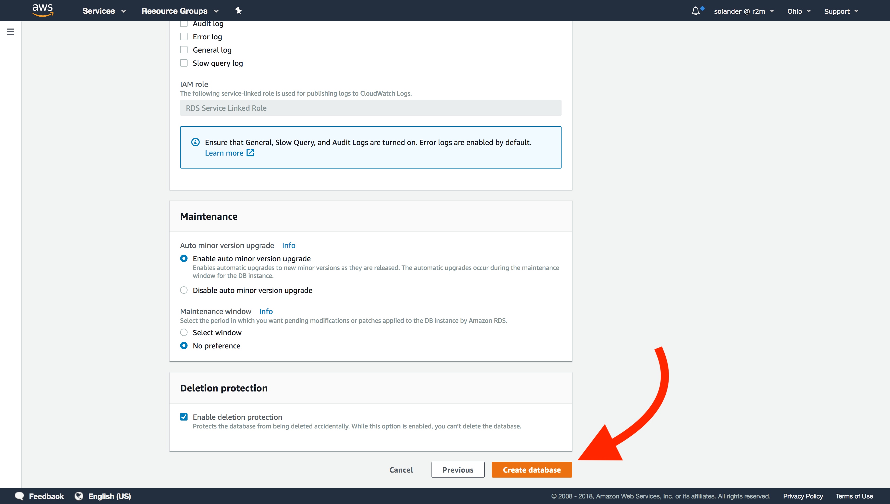

In the next page, click **View DB instance details**

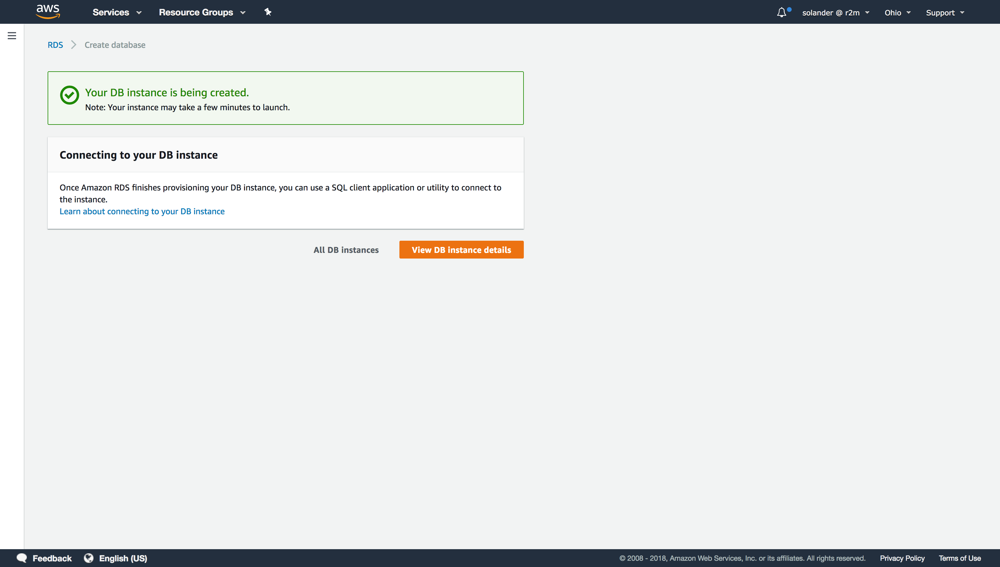


## Getting database details

The database is being created and backed up. Refresh the page and wait for the status to become `available`.


Go to the **Details** section

Make sure that the status is `available` and take note of the endpoint. 

The endpoint will look something like `aws-lambda-lab.your-unique-identifier.us-east-2.rds.amazonaws.com`

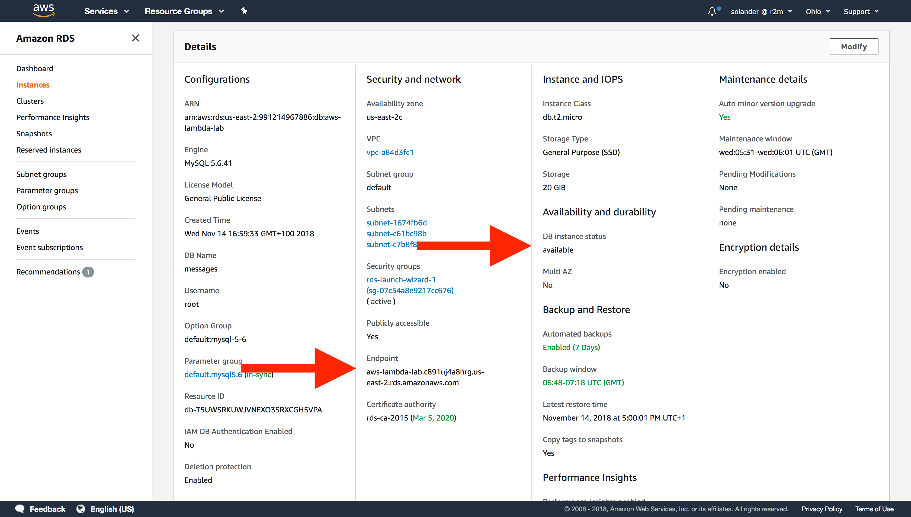


## Creating a table and a stored procedure

Open up your favourite MySQL client. All the examples I use is with the unix terminal one, `mysql`.


### Connect to your database

Remember to replace the host with your actual host. You will need your password, in the example it was `your-super-safe-password`.

```bash
mysql -h aws-lambda-lab.your-unique-identifier.us-east-2.rds.amazonaws.com -u root -p messages
```


### Create the table

If your not in the database `messages`, go there
```mysql
use messages
```

Create the following table:
```mysql
create table messages (
  id int primary key auto_increment,
  username varchar(255) not null,
  message text not null,
  created_time datetime not null default current_timestamp()
);
```


### Create the stored procedure

The POST lambda is expecting a stored procedure `insert_message` to call to insert new messages.
```mysql
delimiter #
create procedure insert_message(
  in p_username varchar(255),
  in p_message text
)
begin
insert into messages (username, message) values (p_username, p_message);
select id, username, message, created_time from messages where id=last_insert_id();
end
#
delimiter ;
```

Try the procedure out:
```mysql
call insert_message('anon', 'Testing the stored procedure');

-- output:
-- +----+----------+------------------------------+---------------------+
-- | id | username | message                      | created_time        |
-- +----+----------+------------------------------+---------------------+
-- |  1 | anon     | Testing the stored procedure | 2018-11-15 17:57:40 |
-- +----+----------+------------------------------+---------------------+
-- 1 row in set (0.34 sec)
-- 
-- Query OK, 0 rows affected (0.34 sec)
```


# Let's create the functions

## Clone the repo

If you haven't already, clone this repo to your computer.
```bash
git clone https://github.com/simonolander/aws-lambda-lab.git
cd aws-lambda-lab
```
There is a folder called `lambdas` in the root of the repo. It contains our two additional folders containing the code for our lambdas, `getMessages` and `postMessage`.
```
.
├── LICENCE and README and stuff...
└── lambdas
    ├── getMessages
    └── postMessage
```
Most of the contents in the folders are libraries for communicating with the database. The entry points for the lambdas (and the only code that isn't a lib) are in the files `getMessages/index.py` and `postMessage/index.py`. 


## Adding database credentials

The lambdas are not yet complete; they are missing credentials for the database. Create a file called `rds_config.py` and add the same information as below, but with your own `rds_host` and `rds_password`.
```python
rds_host = "aws-lambda-lab.your-unique-identifier.us-east-2.rds.amazonaws.com"
rds_username = "root"
rds_password = "your-super-safe-password"
rds_db_name = "messages"
```

Place a copy of `rds_config.py` in `lambdas/getMessages` and `lambdas/postMessage` respectively. You should have the following structure.
```
.
└── lambdas
    ├── getMessages
    │   ├── ...
    │   ├── index.py
    │   └── rds_config.py
    └── postMessage
        ├── ...
        ├── index.py
        └── rds_config.py
```

If you have python3 on your computer, you can test that the lambda works by running
```bash
cd lambdas/getMessages/
python3 -c "from index import handler; print(handler({'params': {'querystring': {'limit': '1'}}}, {}));"

# output
# [{'id': 17, 'username': 'sios', 'message': 'Inserting a message from the gateway api section', 'created_time': '2018-11-04 20:42:30+01:00'}]
```
If you get get an error saying **ModuleNotFoundError: No module named 'rds_config'**, make sure that you copied `rds_config.py` to the right place.


## Zipping the folders

The folders need to be zipped before we can upload them to AWS. You need to zip the *entire contents* of `getMessages` and `postMessage` to two separate zip files. Make sure not to include just the contents, do **not** include the root folders `getMessages` and `postMessage` themselves. Remember to include the folders within `getMessages` and `postMessage` recursively. You can zip using whatever tool you like, I usually do
```bash
cd lambdas/getMessages
zip -r ../getMessages.zip *
cd ..
cd postMessage
zip -r ../postMessage.zip *
```
You should have two zip files, one for each code folder. The names of the zip files are not important.
```
.
└── lambdas
    ├── getMessages
    ├── getMessages.zip
    ├── postMessage
    └── postMessage.zip
```
The zips should be about **2.8 MB** in size. If they are smaller, verify that you zipped recursively.
```bash
du -h lambdas/*.zip
# 2.8M	lambdas/getMessages.zip
# 2.8M	lambdas/postMessage.zip
```


# Creating the functions in AWS

## Go to the Lambda service

Click **Services** in the top menu bar, then click **Lamdba** in the menu. In the lambda page, click the big orange button called **Create function**.


## Create the function

Fill in the form for your function. We are doing `getMessages` first.

Field | Value
--- | ---
**Template** | `Author from scratch` 
**Name** | `getMessages` 
**Runtime** | `Python 3.6` 
**Role** | `Create a custom role` (if you already have an existing role, you can use that one) 


You will be taken to a window to create your role. Just leave everything as-is. The role will be called `lambda_basic_execution`.

Click **Allow**


If you come back to the create function page, select `lambda_basic_execution and click **Create function**.

Field | Value
--- | ---
**Role** | `Choose an existing role`
**Existing role** | `lambda_basic_execution`

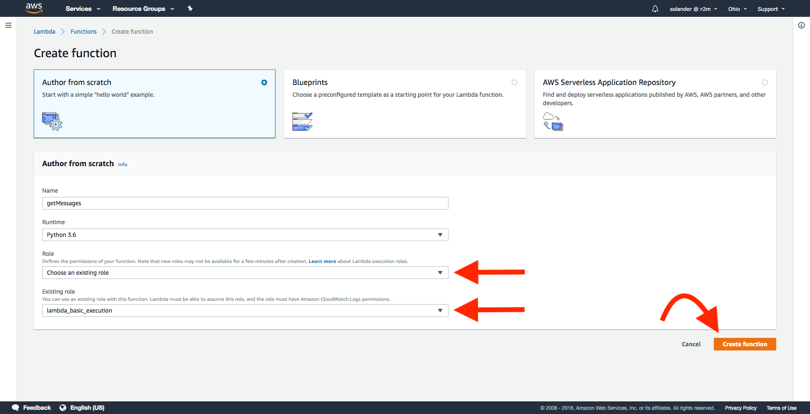


## Upload function code

You will be in a new view showing you a bunch of stuff about your lambda. It's a functioning lambda, but it doesn't do anything useful. We're going to upload the code from `getMessages.zip`.

Go to the section **Function code**

Field | Value
--- | ---
**Code entry type** | `Upload a .zip file`
**Runtime** | `Python 3.6`
**Handler** | `index.handler`
**Function package** | `getMessages.zip`

Click **Save** in the top right corner. It's going to take a couple of seconds.


## Create the postMessage lambda

Go back to **Functions** and create a new lambda the same way. This time call it `postMessage`. Use the same role `lambda_basic_execution` as you used last time. When uploading the function code for this lambda, upload `postMessage.zip` instead of the first zip file. Click **Save**.

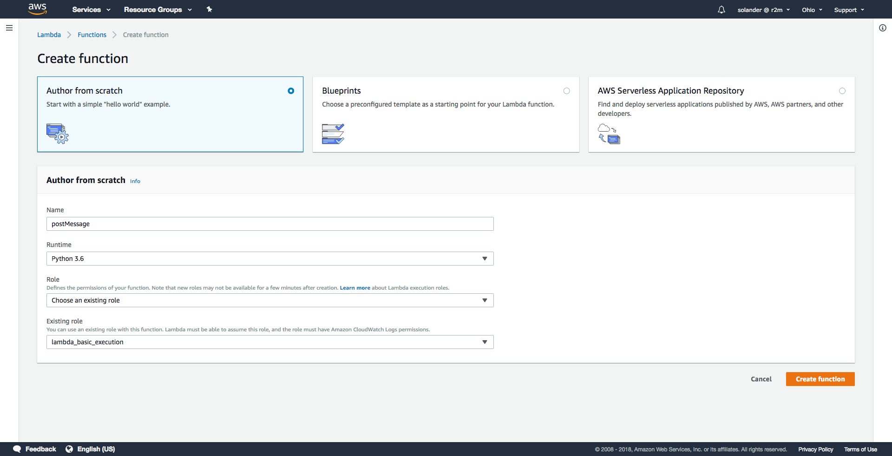
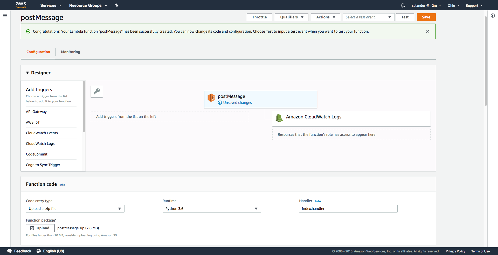


# Create a REST API

## Go to API Gateway

Click **Services** in the top menu again. This time go to **API Gateway**. If you see a welcome screen, click **Get started**.


## Create messages API

Fill out the API form.

Field | Value
--- | ---
**Template** | `New API`
**API name** | `messages`
**Description** | `Some description`
**Endpoint type** | `Regional`

Click **Create API**


# Create GET method

Select **Create Method** from the **Actions** dropdown.


Select **GET** from the small dropdown under **Resources**, then save by clicking the small checkmark next to the dropdown.


## Specify lamdba function

Field | Value
--- | ---
**Enter Lambda Function** | `getMessages`

Click **Save**


## Different Method Execution sections

You can see four boxes now where we will configure the request and response mappings to the lambda. We will visit all four of them in the following order:
1. Method Request
2. Integration Request
3. Method Response
4. Integration Response


## Configure Method Request

Go to **Method Request**

Expand **URL Query String Parameters** and add a new query string:

Field | Value
--- | ---
**Name** | `limit`
**Required** | `false`
**Caching** | `false`


## Configure Integration Request

Go back to **Method Execution**, then to **Integration Request**

Expand **URL Query String Parameters** add a new entry:

Field | Value
--- | ---
**Name** | `limit`
**Mapped from** | `method.request.querystring.limit`
**Caching** | `false`


A bit down but still in **Integration Request**, expand **Mapping Templates**. We're going to create a new mapping to pass all the arguments to the lambda.

Field | Value
--- | ---
**Request body passthrough** | `When there are no templates defined`

Add a new mapping template

Field | Value
--- | ---
**Content-Type** | `application/json`
**Generate template** | `Method Request passthrough`

Click **Save**


## Configure Method Response

Go back to **Method Execution**, then to **Method Response**

Add a new HTTP Status response:

Field | Value
--- | ---
**Status code** | `400`


## Configure Integration Response

Go back to **Method Execution**, then to **Integration Response**

Add a new integration response:

Field | Value
--- | ---
**Lambda Error Regex** | `Bad Request.*`
**Method response status** | `400`
**Content handling** | `Passthrough`


## Test it out

Go back to **Method Execution**, then to **Test**


Test the method, try changing the limit to different values.


# Creating the POST API

Create a new method POST the same way you created the GET method. Point it to the lambda `postMessage` instead of the first lambda.

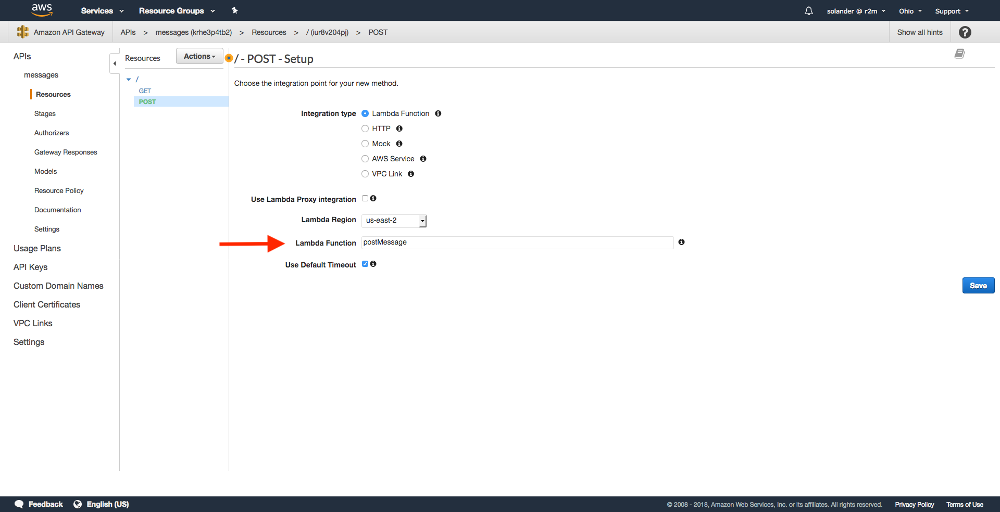


## Configure Integration Request

Under **Integration Request**, add the same request mapping as we did in GET, but leave the query string empty

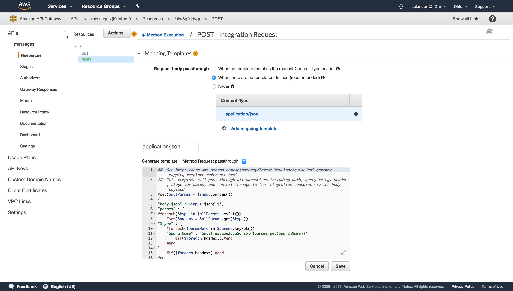


## Configure Method Response

Under **Method Response**, add status code 400 as we did in GET

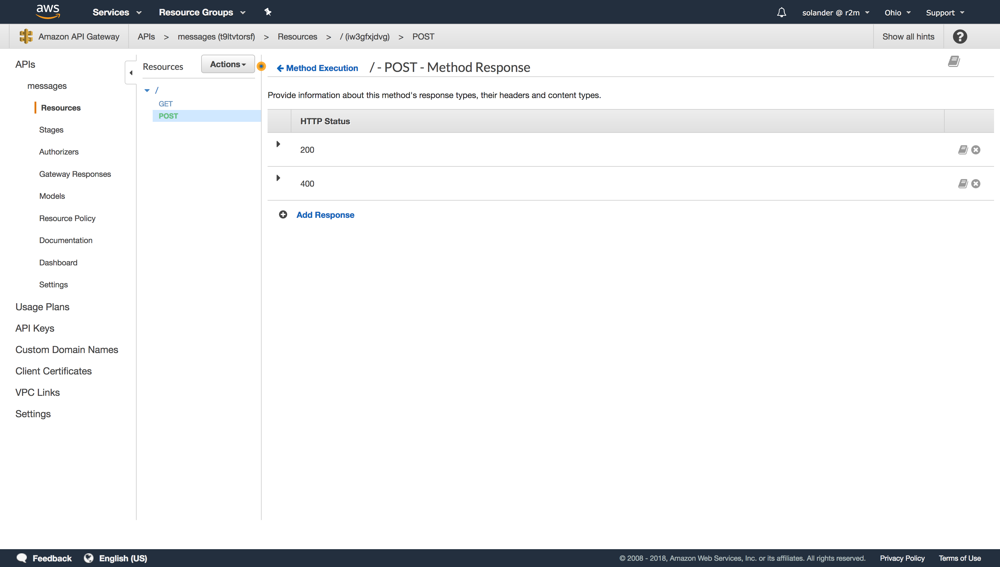


## Configure Integration Response

Under **Integration Response**, add the same response for 400 Bad Request as we did in GET

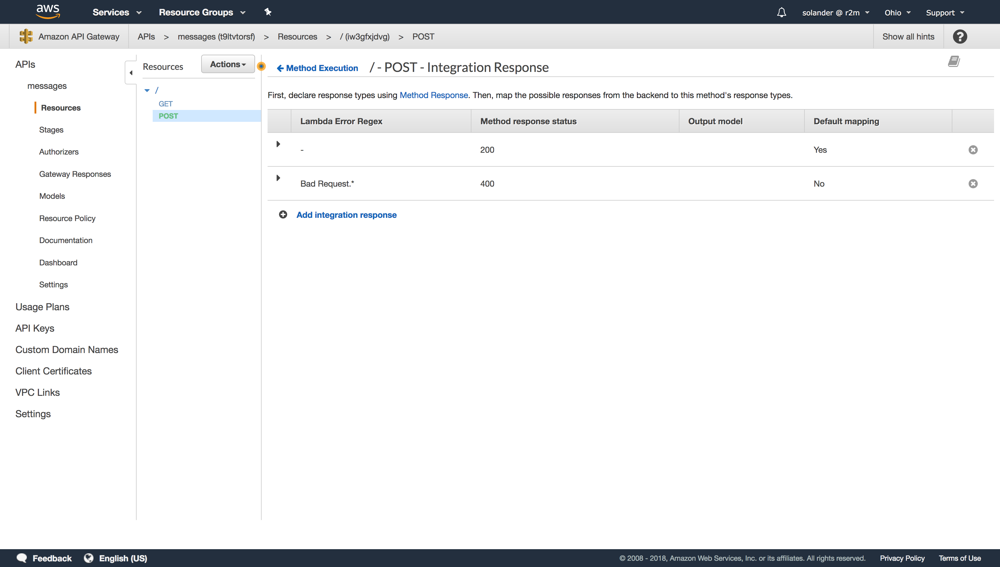


## Test it out!

Go to test and try it out! Remember to specify a request body with `username` and `message`, here is an example:

```json
{
    "username": "anon",
    "message": "Shooting from the API Gateway test area."
}
```

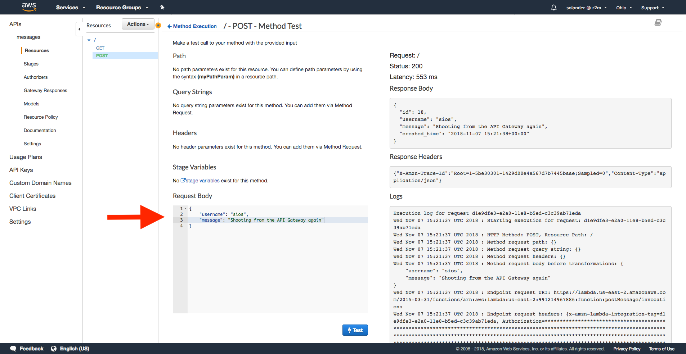


# Enabling CORS

Under the **Actions** dropdown where we created the GET and POST methods, click **Enable CORS**.

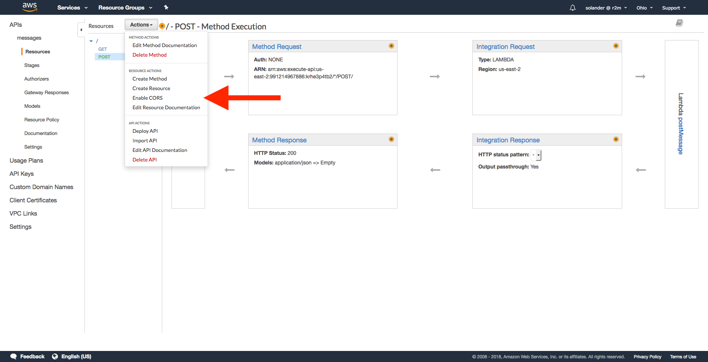


# Deploying the API

The API is not public yet, you need to deploy it to be able to access it outside AWS.

Click **Deploy API** under the **Actions** dropdown.

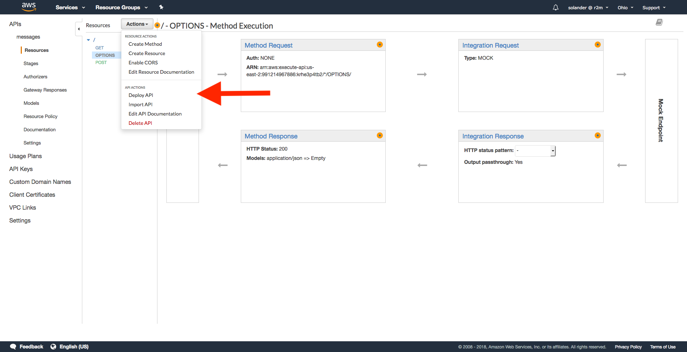

Give the stage a name, e.g. `production`.

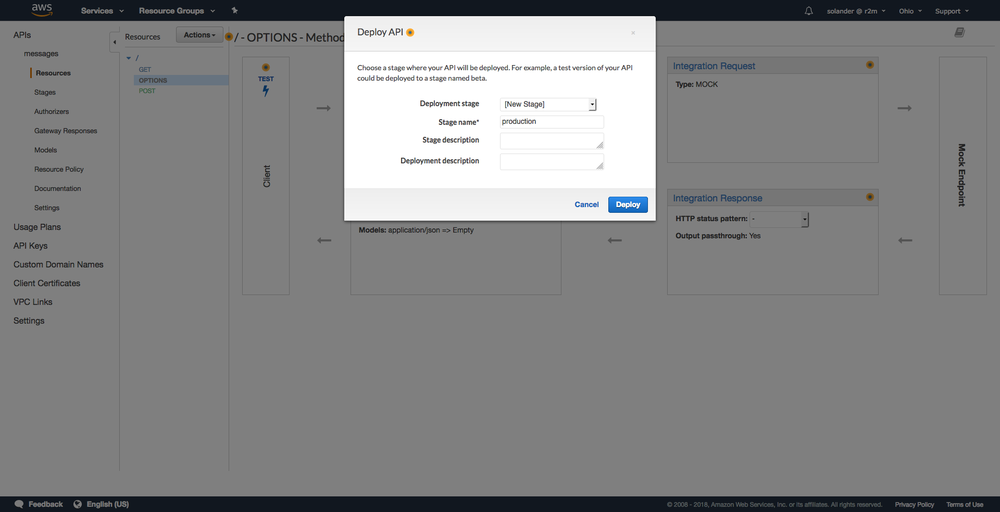

Click or copy the url at the top of the page.

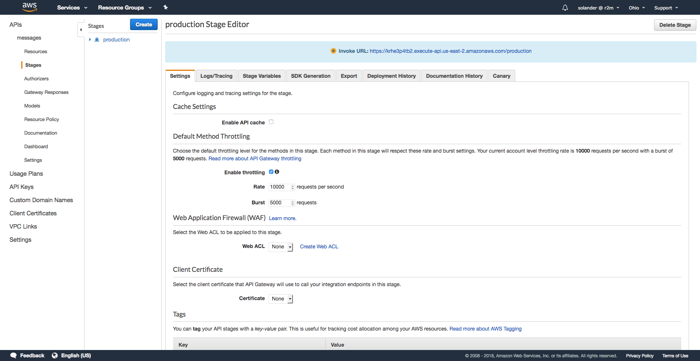

Test it with GET and POST and various parameters. The GET is easiest to test from your browser. If you have curl, you can use the following line to test your POST. Remember to change the url to your url.

```bash
curl -d '{"username": "anon", "message": "hello"}' -H "Content-Type: application/json" -X POST https://your-lambda-id.execute-api.us-east-2.amazonaws.com/production
```
