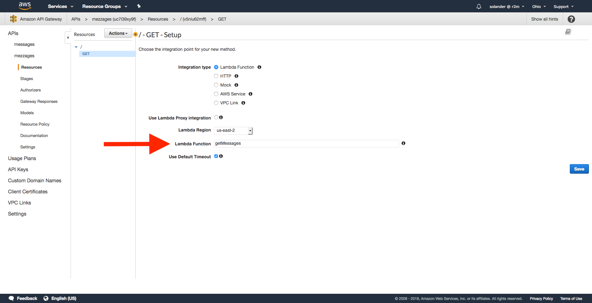
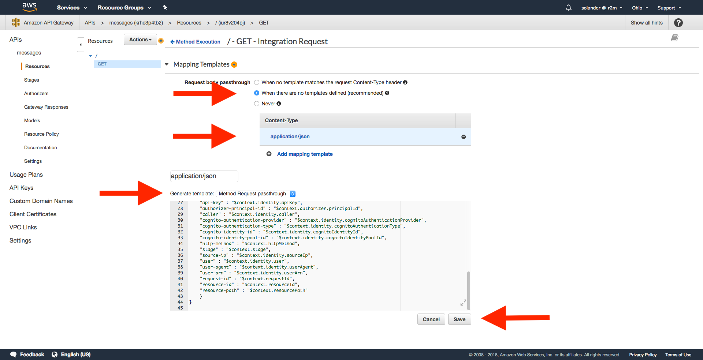
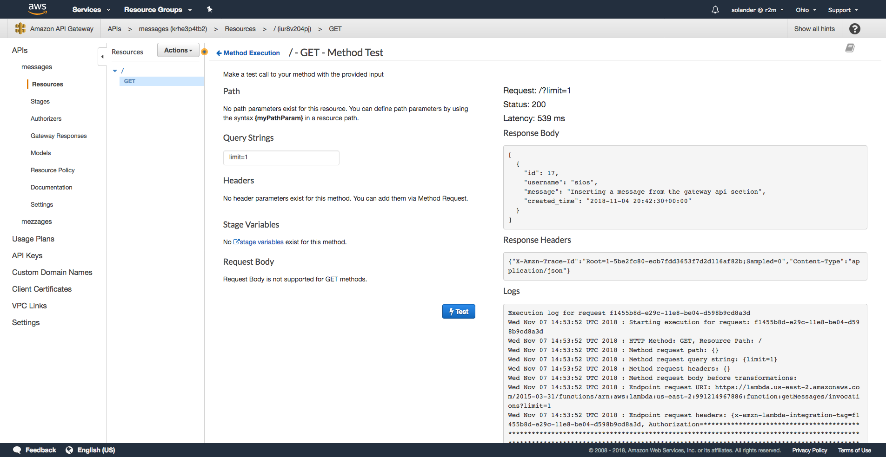

# Academy + AWS = Sant

A hands on introduction to how lambdas, gateways and databases work in AWS. In this lab, we will 
- Create two lambdas that create and retrieve data from a database
- Hook the lambdas up to REST methods
- Actually have everything working
- Set up a database (if we have time)

While doing this, we will learn
- What a lambda function is and how to create one
- What a VPC is
- How to have your lambda talk to your database
- How to map REST requests to your lambdas

Everyone new to AWS spends a long time looking around in configuration files to get stuff to work. By doing a fairly useful thing like connecting REST to a database in a step-by-step way, I hope to have you avoid some of that first time frustration.


## Home prep for you
I need four things of you before we start the lab
1. You all have to be able to log in to AWS Console. If you don't have an account, talk to Anders or head to https://aws.amazon.com/ and hit **Sign up**. It takes a couple of minutes and requires personal details like credit card, but everything in this lab is free.
2. I will also send you a file called **rds_config.py** containing the credentials for the database that we will be working with.
3. Clone this repo to your personal computer.
4. We will be zipping files, make sure you have some program that can create a .zip


## Home prep for me
I have, apart from making this cool *README*, prepared the database and the lambda functions. The lambdas are written in Python and are located in the *lambdas*-folder in this repo. I prepped them to save you time, and to test the code beforehand. We will look at them a bit more later.

The database is an MySQL RDS instance that is up and running at AWS. I prepared this not because it's hard, but because it takes some time to instantiate and we only need one anyway. We will look at the database setup in the end if we have time.


# Let's create the functions

## Adding the config file

If you haven't already, clone this repo to your computer.
```bash
git clone [INSERT URL]
```
There is a folder called `lambdas` in the root of the repo. It contains our two additional folders containing the code for our lambdas, `getMessages` and `postMessage`.
```
.
├── LICENCE and README and stuff...
└── lambdas
    ├── getMessages
    └── postMessage
```
Most of the contents in the folders are libraries for communicating with the database. The entry points for the lambdas (and the only code that isn't a lib) are in the files `getMessages/index.py` and `postMessage/index.py`. The lambdas are not yet complete; they are missing credentials for the database. Take the file `rds_config.py` that you've recieved by email and place it in each of the lambda folders. Your should have the following structure.
```
.
└── lambdas
    ├── getMessages
    │   ├── ...
    │   ├── index.py
    │   └── rds_config.py
    └── postMessage
        ├── ...
        ├── index.py
        └── rds_config.py
```
The structure of `rds_config.py` looks like this, but with the actual password.
```python
rds_host = "r2m-academy-lab.c891uj4a8hrg.us-east-2.rds.amazonaws.com"
rds_username = "root"
rds_password = "password"
rds_db_name = "r2m_academy_lab"
```
If you have python3 on your computer, you can test that the lambda works by running
```bash
cd lambdas/getMessages/
python3 -c "from index import handler; print(handler({'params': {'querystring': {'limit': '1'}}}, {}));"

# output
[{'id': 17, 'username': 'sios', 'message': 'Inserting a message from the gateway api section', 'created_time': '2018-11-04 20:42:30+01:00'}]
```
If you get get an error saying **ModuleNotFoundError: No module named 'rds_config'**, make sure that you copied `rds_config.py` to the right place.


## Zipping the folders

The folders need to be zipped before we can upload them to AWS. You need to zip the *entire contents* of `getMessages` and `postMessage` to two separate zip files. Make sure not to include just the contents, do **not** zip the folders themselves. You can zip using whatever you like, I usually do
```bash
cd lambdas/getMessages
zip -r ../getMessages.zip *
cd ..
cd postMessage
zip -r ../postMessage.zip *
```
You should have two zip files, one for each code folder. The names of the zip files are not important.
```
.
└── lambdas
    ├── getMessages
    ├── getMessages.zip
    ├── postMessage
    └── postMessage.zip
```


# Creating the functions in AWS

## Sign in to AWS and go to Lambdas
Sign in to AWS at https://aws.amazon.com. The sign in option is in the top right corner. We are going to the *Service* called *Lambda*.


Click **Services** in the top menu bar, then click **Lamdba** in the menu.

Click the big orange button called **Create function**.


## Create the function

Fill in the form for your function. We are doing `getMessages` first.

Field | Value
--- | ---
**Template** | `Author from scratch` 
**Name**     | `getMessages` 
**Runtime**  | `Python 3.6` 
**Role**     | `Create a custom role` (if you already have an existing role, you can use that one) 


## Create a new custom roll


You will be taken to a window to create your role. Just leave everything as-is. The role will be called `lambda_basic_execution`.

Click **Create function**


## Upload function code


You will be in a new view showing you a bunch of stuff about your lambda. It's a functioning lambda, but it doesn't do anything useful. We're going to upload the code from `getMessages.zip`.

Go to the section **Function code**

Field | Value
--- | ---
**Code entry type** | `Upload a .zip file`
**Runtime** | `Python 3.6`
**Handler** | `index.handler`
**Function package** | `getMessages.zip`

Click **Save** in the top right corner. It's going to take a couple of seconds.


# Adding a REST API

## Go to API Gateway


Click **Services** in the top menu again. This time go to **API Gateway**.
If you see a welcome screen, click **Get started**.


## Create messages API


Fill out the API form.

Field | Value
--- | ---
**Template** | `New API`
**API name** | `messages`
**Description** | `Some description`
**Endpoint type** | `Regional`

Click **Create API**


## Create GET method


Select **Create Method** from the **Actions** dropdown.


Select **GET** from the small dropdown under **Resources**

Click the small checkmark next to the dropdown


## Specify lamdba function



Field | Value
--- | ---
**Enter Lambda Function** | `getMessages`

Click **Save**


## Different Method Execution sections


You can see four boxes now where we will configure the request and response mappings to the lambda. We will visit all four of them in the following order:
1. Method Request
2. Integration Request
3. Method Response
4. Integration Response


## Configure Method Request


Go to **Method Request**
Expand **URL Query String Parameters** and add a new query string.

Field | Value
--- | ---
**Name** | `limit`
**Required** | `false`
**Caching** | `false`


## Configure Integration Request


Go back to **Method Execution**, then to **Integration Request**
Expand **URL Query String Parameters** add a new entry:

Field | Value
--- | ---
**Name** | `limit`
**Mapped from** | `method.request.querystring.limit`
**Caching** | `false`




Expand **Mapping Templates**

Field | Value
--- | ---
**Request body passthrough** | `When there are no templates defined`

Add a new mapping template

Field | Value
--- | ---
**Content-Type** | `application/json`
**Generate template** | `Method Request passthrough`

Click **Save**


## Configure Method Response


Go back to **Method Execution**, then to **Method Response**
Add a new HTTP Status response

Field | Value
--- | ---
**Status code** | `400`


## Configure Integration Response


Go back to **Method Execution**, then to **Integration Response**
Add a new integration response

Field | Value
--- | ---
**Lambda Error Regex** | `Bad Request.*`
**Method response status** | `400`
**Content handling** | `Passthrough`


## Test it out


Go back to **Method Execution**, then to **Test**



Test the method, try changing the limit to different values.


# Gateway
Choose new API
Choose API name
Enter some description of the API
Choose endpoint type regional
Hit create

Under the Actions dropdown, select create method
Select Method type GET
Hit the checkmark

In the setup select
Integration type: Lambda Function
Use Lambda Proxy integration: True
Lambda Function: getMessages
Lambda Region: us-west-2
Use Default Timeout: True
Hit Save
Accept the permissions popup

Method Execution

Go to Method Request
Authorization: NONE
Request Validator: Validate query string parameters and headers
API Key Required: false
Under URL Query String Parameters
Create a new parameter
Name: limit
Required: false
Caching: false

Go back to Method Execution
Go to Integration Request
Integration type: Lambda Function
Use Lambda Proxy integration: False
Lambda Region: us-west-2
Lambda Function: getMessages
Execution role: None
Invoke with caller credentials: false
Credentials cache: Do not add caller credentials to cache key
Use Default Timeout: true
Under URL Query String Parameters add a new entry:
Name: limit
Mapped from: method.request.querystring.limit
Caching: false
Under Mapping Templates:
Request body passthrough: When there are no templates defined
Under Content type, add a new mapping template:
Content type: application/json
Generate template: Method Request Passthrough
Hit Save
```
##  See http://docs.aws.amazon.com/apigateway/latest/developerguide/api-gateway-mapping-template-reference.html
##  This template will pass through all parameters including path, querystring, header, stage variables, and context through to the integration endpoint via the body/payload
#set($allParams = $input.params())
{
"body-json" : $input.json('$'),
"params" : {
#foreach($type in $allParams.keySet())
    #set($params = $allParams.get($type))
"$type" : {
    #foreach($paramName in $params.keySet())
    "$paramName" : "$util.escapeJavaScript($params.get($paramName))"
        #if($foreach.hasNext),#end
    #end
}
    #if($foreach.hasNext),#end
#end
},
"stage-variables" : {
#foreach($key in $stageVariables.keySet())
"$key" : "$util.escapeJavaScript($stageVariables.get($key))"
    #if($foreach.hasNext),#end
#end
},
"context" : {
    "account-id" : "$context.identity.accountId",
    "api-id" : "$context.apiId",
    "api-key" : "$context.identity.apiKey",
    "authorizer-principal-id" : "$context.authorizer.principalId",
    "caller" : "$context.identity.caller",
    "cognito-authentication-provider" : "$context.identity.cognitoAuthenticationProvider",
    "cognito-authentication-type" : "$context.identity.cognitoAuthenticationType",
    "cognito-identity-id" : "$context.identity.cognitoIdentityId",
    "cognito-identity-pool-id" : "$context.identity.cognitoIdentityPoolId",
    "http-method" : "$context.httpMethod",
    "stage" : "$context.stage",
    "source-ip" : "$context.identity.sourceIp",
    "user" : "$context.identity.user",
    "user-agent" : "$context.identity.userAgent",
    "user-arn" : "$context.identity.userArn",
    "request-id" : "$context.requestId",
    "resource-id" : "$context.resourceId",
    "resource-path" : "$context.resourcePath"
    }
}
```
Go back to Method Execution
Go to Method Response
Add a new Response:
Status Code: 400

Go back to Method Execution
Go to Integration Response
Add a new Integration Response:
Lambda Error Regex: Bad Request.*
Method response status: 400
Content handling: Passthrough

Go back to Method Execution
Go to Test
Test with different request parameters

Create a post method in the same way
This time, we change nothing in the Method request settings
In the Integration Request section, we add a application/json mapping exactly like the one we did in getMessages
In the Method Response section, we add 400 as a possible response code
In the Integration Response section, we add the same mapping as in getMessages
Now we can test the POST method as well!

```
sios:Desktop sios$ mysql -h r2m-academy-lab.c891uj4a8hrg.us-east-2.rds.amazonaws.com -u root -p r2m_academy_lab
Enter password:
Reading table information for completion of table and column names
You can turn off this feature to get a quicker startup with -A

Welcome to the MySQL monitor.  Commands end with ; or \g.
Your MySQL connection id is 21
Server version: 8.0.11 Source distribution

Copyright (c) 2000, 2018, Oracle and/or its affiliates. All rights reserved.

Oracle is a registered trademark of Oracle Corporation and/or its
affiliates. Other names may be trademarks of their respective
owners.

Type 'help;' or '\h' for help. Type '\c' to clear the current input statement.

mysql> show tables;
+---------------------------+
| Tables_in_r2m_academy_lab |
+---------------------------+
| messages                  |
+---------------------------+
1 row in set (0.72 sec)

mysql> describe messages;
+--------------+--------------+------+-----+-------------------+----------------+
| Field        | Type         | Null | Key | Default           | Extra          |
+--------------+--------------+------+-----+-------------------+----------------+
| id           | int(11)      | NO   | PRI | NULL              | auto_increment |
| username     | varchar(255) | NO   |     | NULL              |                |
| message      | text         | NO   |     | NULL              |                |
| created_time | datetime     | NO   |     | CURRENT_TIMESTAMP |                |
+--------------+--------------+------+-----+-------------------+----------------+
4 rows in set (0.13 sec)

mysql> select * from messages;
+----+----------+---------------------+---------------------+
| id | username | message             | created_time        |
+----+----------+---------------------+---------------------+
|  1 | sios     | First message whoo! | 2018-11-04 13:00:05 |
+----+----------+---------------------+---------------------+
1 row in set (0.19 sec)```