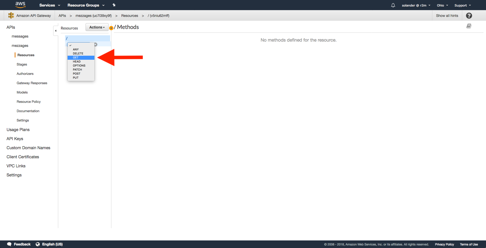
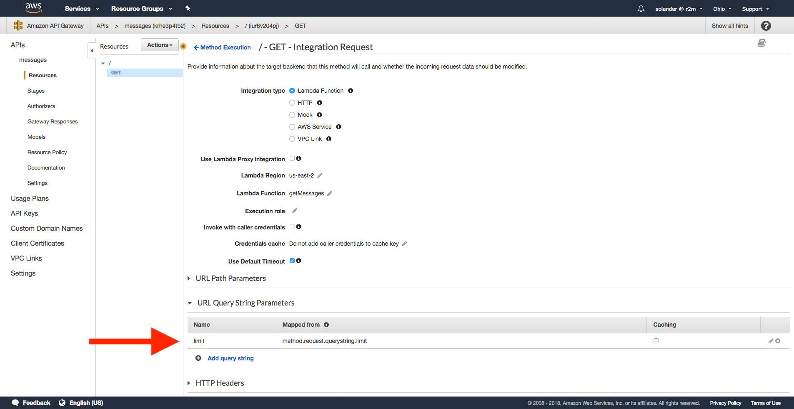

# Academy + AWS = Sant

A hands on introduction to how lambdas, gateways and databases work in AWS. In this lab, we will 
- Create two lambdas that create and retrieve data from a database
- Hook the lambdas up to REST methods
- Actually have everything working
- Set up a database (if we have time)

While doing this, we will learn
- What a lambda function is and how to create one
- What a VPC is
- How to have your lambda talk to your database
- How to map REST requests to your lambdas

Everyone new to AWS spends a long time looking around in configuration files to get stuff to work. By doing a fairly useful thing like connecting REST to a database in a step-by-step way, I hope to have you avoid some of that first time frustration.


## Home prep for you
I need four things of you before we start the lab
1. You all have to be able to log in to AWS Console. If you don't have an account, talk to Anders or head to https://aws.amazon.com/ and hit **Sign up**. It takes a couple of minutes and requires personal details like credit card, but everything in this lab is free.
2. I will also send you a file called **rds_config.py** containing the credentials for the database that we will be working with. Keep this safe somewhere.
3. Clone this repo to your personal computer.
4. We will be zipping files, make sure you have some program that can create a .zip


## Home prep for me
I have, apart from making this cool *README*, prepared the database and the lambda functions. The lambdas are written in Python and are located in the *lambdas*-folder in this repo. I prepped them to save you time, and to test the code beforehand. We will look at them a bit more later.

The database is an MySQL RDS instance that is up and running at AWS. I prepared this not because it's hard, but because it takes some time to instantiate and we only need one anyway. We will look at the database setup in the end if we have time.


# Let's create the functions

## Adding the config file

If you haven't already, clone this repo to your computer.
```bash
git clone [INSERT URL]
```
There is a folder called `lambdas` in the root of the repo. It contains our two additional folders containing the code for our lambdas, `getMessages` and `postMessage`.
```
.
├── LICENCE and README and stuff...
└── lambdas
    ├── getMessages
    └── postMessage
```
Most of the contents in the folders are libraries for communicating with the database. The entry points for the lambdas (and the only code that isn't a lib) are in the files `getMessages/index.py` and `postMessage/index.py`. The lambdas are not yet complete; they are missing credentials for the database. Take the file `rds_config.py` that you've recieved by email and place it in each of the lambda folders. Your should have the following structure.
```
.
└── lambdas
    ├── getMessages
    │   ├── ...
    │   ├── index.py
    │   └── rds_config.py
    └── postMessage
        ├── ...
        ├── index.py
        └── rds_config.py
```
The structure of `rds_config.py` looks like this, but with the actual password.
```python
rds_host = "r2m-academy-lab.c891uj4a8hrg.us-east-2.rds.amazonaws.com"
rds_username = "root"
rds_password = "password"
rds_db_name = "r2m_academy_lab"
```
If you have python3 on your computer, you can test that the lambda works by running
```bash
cd lambdas/getMessages/
python3 -c "from index import handler; print(handler({'params': {'querystring': {'limit': '1'}}}, {}));"

# output
[{'id': 17, 'username': 'sios', 'message': 'Inserting a message from the gateway api section', 'created_time': '2018-11-04 20:42:30+01:00'}]
```
If you get get an error saying **ModuleNotFoundError: No module named 'rds_config'**, make sure that you copied `rds_config.py` to the right place.


## Zipping the folders

The folders need to be zipped before we can upload them to AWS. You need to zip the *entire contents* of `getMessages` and `postMessage` to two separate zip files. Make sure not to include just the contents, do **not** zip the folders themselves. You can zip using whatever you like, I usually do
```bash
cd lambdas/getMessages
zip -r ../getMessages.zip *
cd ..
cd postMessage
zip -r ../postMessage.zip *
```
You should have two zip files, one for each code folder. The names of the zip files are not important.
```
.
└── lambdas
    ├── getMessages
    ├── getMessages.zip
    ├── postMessage
    └── postMessage.zip
```


# Creating the functions in AWS

## Sign in to AWS and go to Lambdas
Sign in to AWS at https://console.aws.amazon.com/. The sign in option is in the top right corner. We are going to the *Service* called *Lambda*.


Click **Services** in the top menu bar, then click **Lamdba** in the menu.

Click the big orange button called **Create function**.


## Create the function

Fill in the form for your function. We are doing `getMessages` first.

Field | Value
--- | ---
**Template** | `Author from scratch` 
**Name**     | `getMessages` 
**Runtime**  | `Python 3.6` 
**Role**     | `Create a custom role` (if you already have an existing role, you can use that one) 


## Create a new custom roll


You will be taken to a window to create your role. Just leave everything as-is. The role will be called `lambda_basic_execution`.

Click **Allow** then **Create function**


## Upload function code


You will be in a new view showing you a bunch of stuff about your lambda. It's a functioning lambda, but it doesn't do anything useful. We're going to upload the code from `getMessages.zip`.

Go to the section **Function code**

Field | Value
--- | ---
**Code entry type** | `Upload a .zip file`
**Runtime** | `Python 3.6`
**Handler** | `index.handler`
**Function package** | `getMessages.zip`

Click **Save** in the top right corner. It's going to take a couple of seconds.


## Create the postMessage lambda

Go back to **Functions** and create a new lambda the same way. This time call it `postMessage`. Use the same role `lambda_basic_execution` as you used last time. When uploading the function code for this lambda, upload `postMessage.zip` instead of the first zip file. Click **Save**.


# Adding a REST API

## Go to API Gateway


Click **Services** in the top menu again. This time go to **API Gateway**.
If you see a welcome screen, click **Get started**.


## Create messages API


Fill out the API form.

Field | Value
--- | ---
**Template** | `New API`
**API name** | `messages`
**Description** | `Some description`
**Endpoint type** | `Regional`

Click **Create API**


## Create GET method


Select **Create Method** from the **Actions** dropdown.



Select **GET** from the small dropdown under **Resources**

Click the small checkmark next to the dropdown


## Specify lamdba function


Field | Value
--- | ---
**Enter Lambda Function** | `getMessages`

Click **Save**


## Different Method Execution sections


You can see four boxes now where we will configure the request and response mappings to the lambda. We will visit all four of them in the following order:
1. Method Request
2. Integration Request
3. Method Response
4. Integration Response


## Configure Method Request


Go to **Method Request**
Expand **URL Query String Parameters** and add a new query string.

Field | Value
--- | ---
**Name** | `limit`
**Required** | `false`
**Caching** | `false`


## Configure Integration Request



Go back to **Method Execution**, then to **Integration Request**
Expand **URL Query String Parameters** add a new entry:

Field | Value
--- | ---
**Name** | `limit`
**Mapped from** | `method.request.querystring.limit`
**Caching** | `false`


Expand **Mapping Templates**

Field | Value
--- | ---
**Request body passthrough** | `When there are no templates defined`

Add a new mapping template

Field | Value
--- | ---
**Content-Type** | `application/json`
**Generate template** | `Method Request passthrough`

Click **Save**


## Configure Method Response


Go back to **Method Execution**, then to **Method Response**
Add a new HTTP Status response

Field | Value
--- | ---
**Status code** | `400`


## Configure Integration Response


Go back to **Method Execution**, then to **Integration Response**
Add a new integration response

Field | Value
--- | ---
**Lambda Error Regex** | `Bad Request.*`
**Method response status** | `400`
**Content handling** | `Passthrough`


## Test it out


Go back to **Method Execution**, then to **Test**


Test the method, try changing the limit to different values.


## Creating the POST API

1. Create a new method POST the same way you created the GET method
2. Point it to the lambda `postMessage` instead of the first lambda
3. Under **Integration Request**, add the same request mapping, but leave the query string empty
4. Under **Method Response** add status code 400 as we did in GET
5. Under **Integration Response** add the same response for 400 Bad Request as we did in GET
6. Test it out!


## Enabling CORS

Under the **Actions** dropdown where we created the GET and POST methods, click **Enable CORS**.

